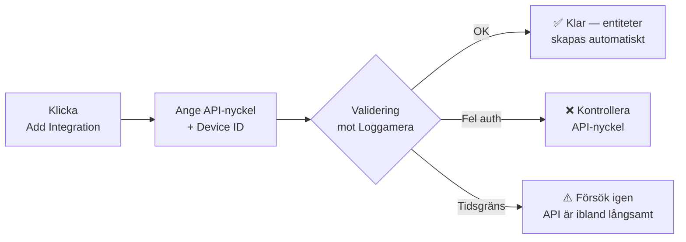

# Comfortzone Heat Pump

**Smart Home Assistant-integration för Comfortzone frånluftsvärmepumpar via Loggamera-API:t.**

[![HACS][hacs-badge]][hacs-url]
[![Version][version-badge]][release-url]
[![License][license-badge]][license-url]
[![Home Assistant][ha-badge]][ha-url]

[Installera](#-installation) · [Konfiguration](#%EF%B8%8F-konfiguration) · [Entiteter](#-entiteter) · [Dashboards](#-dashboard-exempel) · [Felsökning](#-felsökning)

---

## ✨ Funktioner

| | |
| :-- | :-- |
| 🌡️ **Klimatentitet** | Styr inomhustemperatur, läs av kompressor och ventiltillstånd. |
| 🚿 **Varmvatten** | Justera börvärde, aktivera extra varmvatten, övervaka temperatur. |
| 📊 **24+ sensorer** | Inomhus, ute, frånluft, kompressor­effekt, frekvens, fläkthastighet, tillsats m.m. |
| 🚨 **Larm & status** | Filterlarm, huvudlarm, kompressor­status, ventil­läge — allt som binär­sensorer. |
| 🎚️ **Värmekurva** | Justera värmekurva och semester­dagar direkt från dashboarden. |
| 🛡️ **Smart kö** | Inbyggd kö och retry hanterar långsam Loggamera-API utan att krascha integrationen. |
| 🇸🇪 **Svensk översättning** | Hela konfigurations­flödet på svenska. |
| 🩺 **Diagnostik** | Inbyggd "Download Diagnostics" med redacted API-nyckel — perfekt för bug-rapporter. |

---

## 🚀 Installation

### Steg 1 — Lägg till repot i HACS (one-click)

> 💡 **Klicka knappen ovan** för att öppna HACS direkt i din Home Assistant och förhandsgranska repot. Klicka sedan **DOWNLOAD**.

📖 Manuell HACS-installation (om knappen inte fungerar)

1. Öppna **HACS** i Home Assistant.
2. Klicka på **⋮** (tre prickar) uppe till höger → **Custom repositories**.
3. Klistra in `https://github.com/tenganmade/comfortzone` och välj kategori **Integration**.
4. Klicka **ADD**, sök sedan upp *Comfortzone Heat Pump* i listan och tryck **DOWNLOAD**.
5. **Starta om Home Assistant.**

🛠️ Manuell installation utan HACS

1. Ladda ner senaste releasen från [Releases][release-url].
2. Kopiera mappen `custom_components/comfortzone/` till `<config>/custom_components/comfortzone/` på din HA-instans.
3. Starta om Home Assistant.

### Steg 2 — Lägg till integrationen

> 💡 **Klicka knappen** för att hoppa direkt till "Add Integration"-dialogen — den är förifylld med rätt domän.

Eller manuellt: **Inställningar → Enheter & tjänster → + Lägg till integration → Comfortzone Heat Pump**.

---

## ⚙️ Konfiguration

Du behöver två uppgifter från [Loggamera-portalen](https://platform.loggamera.se):

| Fält | Var hittar jag det? |
| :-- | :-- |
| **API-nyckel** | Loggamera-portalen → ditt konto → *API-nycklar* → generera/kopiera. |
| **Enhets-ID** | Loggamera-portalen → välj din värmepump → ID:t står i URL eller enhetsdetaljer (ett heltal). |
| **Modell** | Välj `RX95` (eller `Other` om du har en annan modell). Kan ändras senare. |

---

## 📊 Entiteter

<b>Klimat & varmvatten</b>

| Entitet | Typ | Beskrivning |
| :-- | :-- | :-- |
| `climate.comfortzone_climate` | Climate | Inomhus­temperatur, HEAT/OFF, HVAC-action |
| `number.comfortzone_hot_water_temp_setpoint` | Number | Börvärde varmvatten (30–65°C) |
| `number.comfortzone_heat_curve` | Number | Värmekurva (0,0–6,0) |
| `number.comfortzone_holiday_reduction_days` | Number | Semesterdagar (0–9) |
| `switch.comfortzone_hot_water_extra` | Switch | Extra varmvatten |
| `button.comfortzone_acknowledge_alarm` | Button | Kvittera huvudlarm |
| `button.comfortzone_reset_filter_alarm` | Button | Återställ filterlarm |

<b>Temperatur­sensorer</b>

`indoor_temp`, `outdoor_temp`, `hot_water_temp`, `heat_carrier_in`, `heat_carrier_out`, `exhaust_air_temp`, `set_indoor_temp`, `target_hw_temp`, `heater_element_allowed`

<b>Effekt, frekvens, fläkt</b>

`compressor_power`, `addition_power`, `total_output_power`, `compressor_freq`, `compressor_freq_max`, `circulation_pump_speed`, `fan_speed_current`

<b>Larm & ventiler (binary sensors)</b>

`filter_alarm`, `main_alarm`, `compressor_active`, `room_thermostat`, `heating_valve`, `hot_water_valve`, `cooling_installed`, `cooling_enabled`, `dual_heating_curves`

---

## 🎨 Dashboard-exempel

Se [docs/dashboard_examples.md](docs/dashboard_examples.md) för färdiga Lovelace-kort:

- 🎛️ **Översikt** — klimat, varmvatten, larm i ett kort.
- 📈 **Energi** — kompressoreffekt + tillsats över tid.
- ❄️ **Avfrostning** — defrost-intervall och blocktid.

---

## 🩺 Felsökning

| Symptom | Trolig orsak | Lösning |
| :-- | :-- | :-- |
| `cannot_connect` vid setup | Loggamera långsamt eller offline | Vänta 1–2 min och försök igen. Integrationen retry:ar automatiskt vid drift. |
| `invalid_auth` | Fel API-nyckel/Device-ID | Verifiera båda i Loggamera-portalen. |
| Entiteter "unavailable" tillfälligt | API rapporterar `busy` | Normal — gammal data behålls och nästa polling fyller på. |
| Vissa sensorer saknar värde | Modellen rapporterar inte fältet | Vissa fält finns bara på vissa modeller (T.ex. `defrost_*`). |

**Ladda diagnostik:** *Inställningar → Enheter & tjänster → Comfortzone Heat Pump → ⋮ → Download diagnostics*. API-nyckel och Device-ID är redacted automatiskt.

---

## 🤝 Bidrag

PR:s, issue-rapporter och dashboard-exempel är välkomna! Öppna en [issue][issues-url] eller skicka en pull request.

## 📝 Licens

[Apache License 2.0][license-url] © Tengan Made

---

Inte affilierad med Comfortzone Industri AB eller Loggamera AB.

[hacs-badge]: https://img.shields.io/badge/HACS-Custom-41BDF5.svg?style=flat-square
[hacs-url]: https://github.com/hacs/integration
[version-badge]: https://img.shields.io/github/v/release/tenganmade/comfortzone?style=flat-square
[release-url]: https://github.com/tenganmade/comfortzone/releases
[license-badge]: https://img.shields.io/github/license/tenganmade/comfortzone?style=flat-square
[license-url]: https://github.com/tenganmade/comfortzone/blob/main/LICENSE
[ha-badge]: https://img.shields.io/badge/Home%20Assistant-2024.10%2B-41BDF5.svg?style=flat-square&logo=home-assistant
[ha-url]: https://www.home-assistant.io/
[issues-url]: https://github.com/tenganmade/comfortzone/issues
